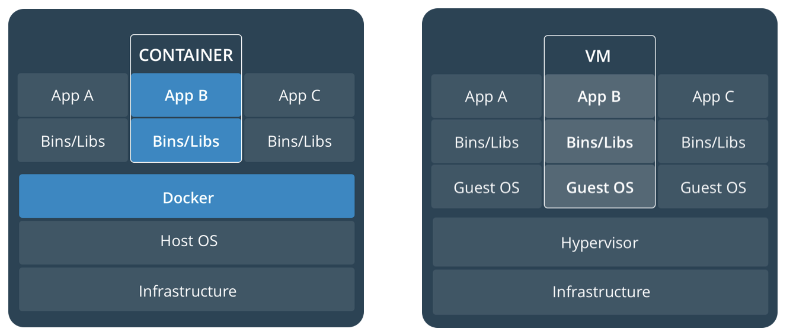

Window 10 Home, Window 7에서는 Docker Toolbox 설치해서 사용하고, 그 이상 버전은 Docker Desktop for Windows를 사용한다. (https://docs.docker.com/toolbox/toolbox_install_windows/)
개인 노트북은 Mac Sierra 10.13.6인데, mac 또한 특정 버전 이상부터 Docker Desktop을 설치하라고 안내한다. 뭘 깔든 그냥 install 버튼 누르면 알아서 그냥 셋팅이 잘 된다😀

docker가 설치되고 나면, ```docker version``` 으로 잘 설치가 됐는지 확인한다.
```docker-machine ls``` 명령어로 보면 현재 Running 중인 docker들이 나온다. (not containers)

#### 주절주절
document를 그냥 읽어내면 정리하면서 읽는 것보단 훨씬 빨리 읽겠지만, 계속 봐야하는 내용이니까 차근차근 정리하려고 한다. Docker의 문서를 조금 읽어보니 참 깔끔하게 정리를 잘 해놓은 것 같다😏 포스팅은 공부하는 걸 정리하는 식의 개념으로 하는 거라, 해석이 틀릴 수도 있고 친절하지 않은 포스팅이 될 것 같다....🤣
https://docs.docker.com/get-started/

#### docker get started 목차

1. Set up your Docker environment
2. Build an image and run it as one container
3. Scale your app to run multiple containers
4. Distribute your app across a cluster
5. Stack services by adding a backend database
6. Deploy your app to production


### [Orientation and setup] Set up your Docker environment

#### Docker concepts
Docker는 developer와 sysadmin이 컨테이너를 사용해 어플리케이션을 개발,배포,운영을 위한 플랫폼이다. 어플리케이션을 배포하는 리눅스 컨테이너의 사용을 containerization라고 부른다. 컨테이너는 새로운 게 아니고, 쉽게 어플리케이션을 배포할 수 있게 해주는 것이다.
*Docker is a platform for developers and sysadmins to develop, deploy, and run applications with containers. The use of Linux containers to deploy applications is called containerization.*


containerization이 인기있는 이유는
유연함 : 진짜 복잡한 application이라도 containerized 할 수 있다.
가볍다 : 컨테이너는 호스트 커널을 활용하고 공유한다.
교체할 수 있는 : 업데이트, 업그레이드를 즉시 배포할 수 있다.
이동성이 높은 : 로컬에서 빌드할 수 있고, 클라우드에 배포할 수 있으며, 어디서든지 운영 가능하다.
scalable : 컨테이너 복제본을 자동으로 늘리고 증가시킬 수 있다.
stackable : 수직적으로 즉석에서 서비스를 stack! 할 수 있다.

*Flexible: Even the most complex applications can be containerized.
Lightweight: Containers leverage and share the host kernel.
Interchangeable: You can deploy updates and upgrades on-the-fly.
Portable: You can build locally, deploy to the cloud, and run anywhere.
Scalable: You can increase and automatically distribute container replicas.
Stackable: You can stack services vertically and on-the-fly.* 이래서 :P


#### Images and Containers
이미지란 게 docker를 살펴보다보면, 아주 많이 나오는 용어이다. **이미지는 실행가능한 패키지**인데, 이 안에는 어플리케이션을 실행할 때 필요한 모든 게 들어 있다. 이미지는 DockerHub에 엄----청나게 방대한 양이 있다고 한다. 내가 사용할 Docker 이미지를 만들어서 사용할 수도 있다고 하고.
(💭install set에 있던 모든 라이브러리나 WAS, 환경설정이 하나로 패키징 돼 있고 이미지를 컨테이너에 띄우기만 하면 동작하니까 가볍긴 엄청 가벼워 보인다.)
*A container is launched by running an image. An **image** is an executable package that includes everything needed to run an application--the code, a runtime, libraries, environment variables, and configuration files.*

컨테이너는 이런 이미지의 runtime instance, 즉 이미지가 메모리 상에 떴을 때를 말한다고 적혀있는데, 영어로 읽는 게 더 와닿는 container의 설명🤣
*A **container** is a runtime instance of an image--what the image becomes in memory when executed (that is, an image with state, or a user process). You can see a list of your running containers with the command, ```docker ps```, just as you would in Linux.*


#### Containers and virtual machines
컨테이너와 VM의 차이점 그림으로 설명. 컨테이너는 host machine의 kernel을 공유한다. 실행가능한 그 어떤것보다 더 메모리를 필요로 하지 않으니 lightweight~ 라고 할만하다. 그와는 반대로 VM은 각각의 Guest OS가 동작하기 때문에, 일반적으로 어플리케이션이 자원을 더 필요로 할수록 더 많은 자원이 든다.

[](https://docs.docker.com/get-started/)


#### Test Docker version
+ 어쨌든 install만 하면 알아서 잘 설치되는 docker, 잘 설치됐는지 버전 확인해보기
```docker --version``` or ```docker info```


#### Test Docker installation
```docker run hello-world``` 명령어를 치면, hello-world 이미지가 없네? 알아서 Pull 땡겨서 run 해줄게요! 한다. ```docker image ls``` 이 명령어로 이미지들 목록도 볼 수 있고, ```docker container ls --all``` 컨테이너 목록과 상태도 볼 수 있다.


#### 그래서 Docker는
배포/테스트/운영도 하고 뭐 이것저것 다 어디서든 쉽게 할 수 있고, 이미지 하나로 스케일 아웃(수평으로 늘리는)도 쉬워서 빠르고 가볍게 같은 어플리케이션을 여러 개 띄울 수도 있고... 호스트OS 하나를 공유하니까 자원도 덜 낭비된다.
**수고롭게** 서버에 어플리케이션 하나 띄울 때 마다 설정 잡아주고 필요한 라이브러리 설치하고 등....을 안해도 된다🤓
