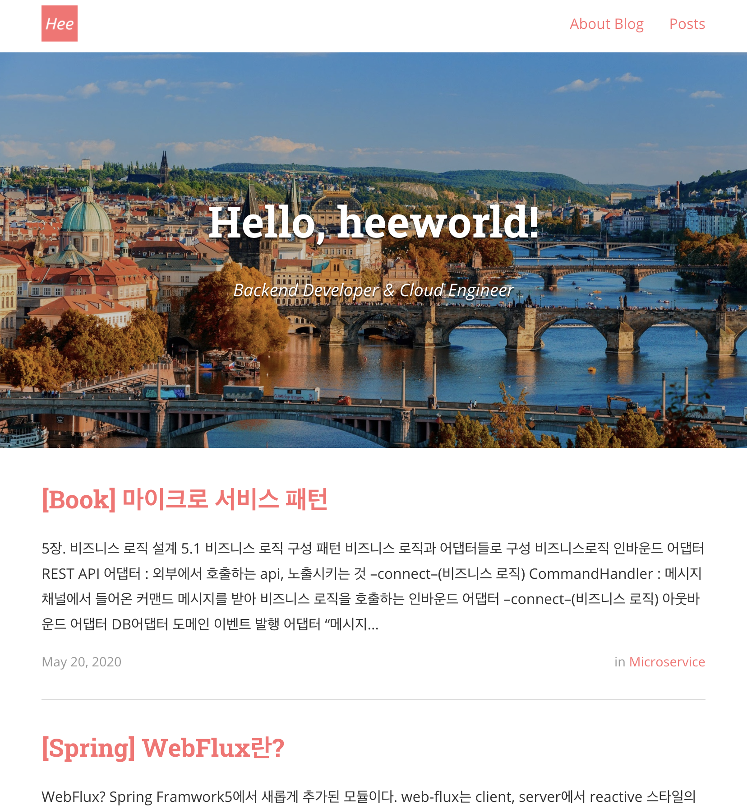

# 블로그 리모델링👷🏻‍
블로그를 시작하게 된 계기는 온전히 이직을 위해서였다.

애초에 학사 전공이 컴퓨터공학 관련도 아니었고, 첫 회사에 입사할 때도 사실 `nullPointerException`도 모르는 상태였다. 필자로써는 정말 운좋게도 첫 회사에서 일도 하고 공부도 하고 어느 정도의 경력도 쌓은 케이스다.

이직 시장에서 조금이라도 살아남기 위해선 개발에 대한 기초 지식뿐만 아니라 알고리즘 공부, 참여 프로젝트 정리, github에 뭐라도 한 기록~~(영향력은 거의 없다고 생각하지만, 이직 준비할 때 마음의 안정을 위해)~~ 등등 '이직할 때 조금 유리할 수도 있을 것 같은데?' 라는 건 다 했다. 블로그도 비슷한 맥락으로!

## 블로그 변천사
다들 그러하듯이(?) tistory부터 시작했다. 그래도 기술 블로그를 한다하면, 네이버 블로그보단 티스토리를 추천했다.

### tistory
포스팅 3개정도 하고 **일도 바쁘고**, 흥미도 잃어서 관뒀다🙃

### github blog by jekyll
남들 하는데 좀 좋아보인다 싶은건 다 따라하고 싶어하는 성격 탓에 `xxx.github.io` 블로그를 만들어야겠다고 마음먹었다.

시작할 당시만 해도, 그냥 가져다 쓰는 것도 어려워서 최대한 능력자분이 만들어 놓으신 템플릿을 사용했다. _(감사합니다!)_

템플릿을 고르는 기준은 딱 2개였다.

1. 보기좋게 예쁠 것
2. 너무 복잡하지 않을 것

이 기준에 부합하는 템플릿을 찾은게 [Centrarium](http://bencentra.com/centrarium/)이었다. 사진이랑 색만 바꿔도 이정도 블로그가 완성되는 아주 심플한 템플릿이었다.

다이어리식 용도의 블로그를 생각했기 때문에 아주 딱 적당했다.

하지만 그래도 포스팅을 10개 이상 하다보니 아쉬웠던 기능이 있었다.
1. 카테고리별 그룹핑이 되긴 하지만, `Posts` 탭에서 제목만 노출
2. `ruby`에 익숙하지 않아서 구성 파악이 어려움 (거의 복붙수준으로만 front를 개발할 줄 아는 상태였음)
3. 댓글기능 없음 (2번의 연장선인데, 설명은 나와있으나 필자의 부족함으로 못함)

그래서 블로그 한번 정리해야겠다. 라고 생각만 1년 정도 하고 있었다.

### github blog by gatsby
이직 이후에 회사 일이 너무 바빠서 개인적으로 컴퓨터를 잡고 있을 시간이 없었다. 여전히 바쁘긴 하지만, 코로나 2.5단계도 풀린 김에 카페에서 뭐라도 두들기고 싶었고(?) 블로그를 갈아 엎게 됐다!

사실 갈아 엎은 것도 아니고, 허접한 포스팅은 그대로고 예전부터 봤던 [한재엽님의 jbee.io](https://jbee.io) 블로그의 템플릿을 사용하고 싶었다. backend에서 frontend로 전향한 동료가 frontend+이직 관련 자료가 좋다며 추천해주었던 github였다.

README.md를 보면서 따라하니 금방 템플릿은 적용됐고 필자의 정보까지 커스텀을 마친 뒤에야 이 포스팅을 쓴다🤓!

약간의 우여곡절이 있었지만 _(gatsby를 github에 deploy하기 위한 설정 후 permission 문제 - sshkey 등록으로 해결!)_ 순탄하게 끝냈다!!!!!!!!!!!

블로그 리모델링도 했으니, 열심히 포스팅을 해야겠다🥰🥰🥰

 
