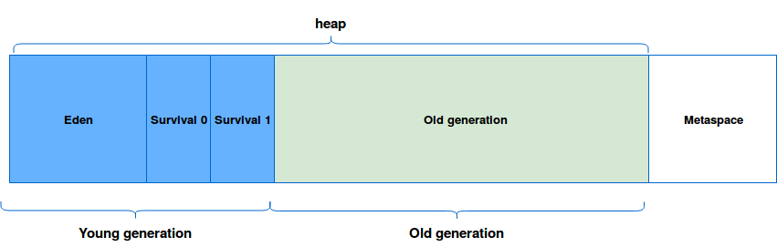

## Java 1.8부터 JVM 메모리 구조 변화 (permGen → metaspace)
java 1.8부터 permGen (permenant Generation) 영역이 사라지고, 대신에 Metaspace 영역이 생겼다.
간단히 설명하자면, permGen은 jvm에 의해 크기가 강제되던 영역으로 OOM을 발생시키는 원인 중 하나였다고 한다.
metaspace 영역이 permGen의 대체 역할을 하는데, metaspace는 native memory영역으로 OS가 자동으로 크기를 조절한다.
그 결과 기존과 비교해 큰 메모리 영역을 사용할 수 있게 되었다!
또한 metaspace는 heap이 아닌 native 메모리 영역이기 때문에, 개발자가 영역 확보의 상한을 크게 의식하지 않아도 되게 되었다(?)고 한다.

> Perm 영역은 보통 Class의 Meta 정보나 Method의 Meta 정보, Static 변수와 상수 정보들이 저장되는 공간으로 흔히 메타데이터 저장 영역이라고도 한다. 이 영역은 Java 8 부터는 Native 영역으로 이동하여 Metaspace 영역으로 변경되었다. (다만, 기존 Perm 영역에 존재하던 Static Object는 Heap 영역으로 옮겨져서 GC의 대상이 최대한 될 수 있도록 하였다)

## JVM 구조
1. JVM은 heap과 metaspace로 나뉜다.
2. heap은 young generation과 old generation으로 나뉜다.
3. young generation은 eden, survival 0, survival 1으로 나뉜다.
4. old generation은 old generation이다.

---

💡참고자료
- https://johngrib.github.io/wiki/java8-why-permgen-removed/
- https://yaboong.github.io/java/2018/06/09/java-garbage-collection/
- https://www.waitingforcode.com/off-heap/on-heap-off-heap-storage/read
- https://www.baeldung.com/java-memory-leaks
