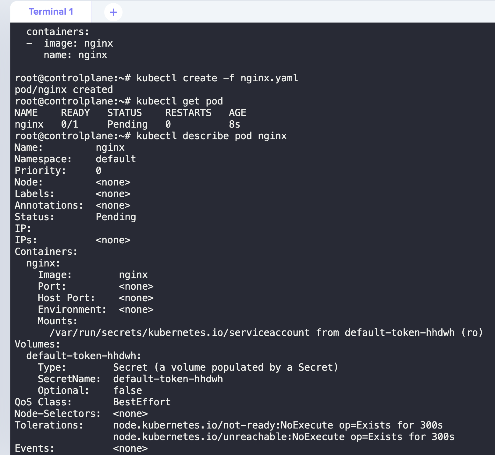

## 📌Scheduling

### 1. manual scheduling

#### scheduler가 없을 때 나타나는 상태값



#### node할당안된 pod에 nodeName으로 node 할당하기
Delete the existing pod first. Run the below command:

`$ kubectl delete po nginx`

To list and know the names of available nodes on the cluster:

`$ kubectl get nodes`

Add the nodeName field under the spec section in the nginx.yaml file with node01 as the value:

```
---
apiVersion: v1
kind: Pod
metadata:
  name: nginx
spec:
  nodeName: node01
  containers:
  -  image: nginx
     name: nginx
```
Then run the command kubectl create -f nginx.yaml to create a pod from the definition file.

To check the status of a nginx pod and to know the node name:

`$ kubectl get pods -o wide`

<br/>

### 2. Labels and Selectors
label을 지정하고 selector로 매칭시키기 :)

>label이 env=prod이고 tier=frontend인 pod 다 조회해주세요!
>
>`kubectl get po -l env=prod,tier=frontend`


### 3. Taints and Tolerations
toleration을 파드에 지정해서 taint를 건 node에 toleration 조건이 부합하지 않으면 접근하지 못하게 함.
그러니까 except의 개념인 것 같다.

A라는 조건을 가진 pod만 `taint nodes nodeAAA A`한 `nodeAAA`에 들어올 수 있는 것!


#### practice test
```
kubectl run bee --image=nginx --restart=Never --dry-run -o yaml > bee.yaml

kubectl explain pod --recursive | grep -A5 tolerations
```


### 4. Node Selectors

특정 노드에 pod 띄우고 싶을 때 사용


라벨은 이렇게 지정

`kubectl label nodes node-1 size=large`

`kubectl label node node01 color=blue`

pod에 `nodeSelector`는 `spec` 아래에 위치!

### 5. Node Affinity

노드 셀렉터와 비슷하게 특정 노드에 pod를 지정해서 띄우고 싶은데, 그런 조건을 조금 더 자유롭게 사용할 수 있음

 `requiredDuringSchedulingIgnoredDuringExecution` 와 `preferredDuringSchedulingIgnoredDuringExecution` 로 부르는 두 가지 종류의 노드 어피니티
그리고 `requiredDuringSchedulingRequiredDuringExecution`까지!

DuringScheduling 상태와 DuringExecution 상태에 따라, 다른 것 같음.

따라서 `requiredDuringSchedulingIgnoredDuringExecution` 의 예로는 "인텔 CPU가 있는 노드에서만 파드 실행"이 될 수 있고, `preferredDuringSchedulingIgnoredDuringExecution` 의 예로는 "장애 조치 영역 XYZ에 파드 집합을 실행하려고 하지만, 불가능하다면 다른 곳에서 일부를 실행하도록 허용"이 있을 것이다.

이렇다고 합니다 :)


*Q. Set Node Affinity to the deployment to place the pods on node01 only.*

``` yaml
apiVersion: apps/v1
kind: Deployment
metadata:
  name: blue
spec:
  replicas: 3
  selector:
    matchLabels:
      run: nginx
  template:
    metadata:
      labels:
        run: nginx
    spec:
      containers:
      - image: nginx
        imagePullPolicy: Always
        name: nginx
      affinity:
        nodeAffinity:
          requiredDuringSchedulingIgnoredDuringExecution:
            nodeSelectorTerms:
            - matchExpressions:
              - key: color
                operator: In
                values:
                - blue
```
### 6. Resource limit

Q. 어떤 값을 바꿔서 파드를 띄우세요 라는 문제에서, 어떻게 커맨드를 치는지?


A. 나같은 경우는 kubectl edit 하고 yaml 저장한 다음에, apply하는 방식을 사용하는데 다른 사람은 어떻게 하는지 궁금!

### 7. DaemonSets
노드가 클러스터에 추가되면 파드도 추가됨!

**용도**
- 모든 노드에서 클러스터 스토리지 데몬 실행
- 모든 노드에서 로그 수집 데몬 실행
- 모든 노드에서 노드 모니터링 데몬 실행

### 8. Static Pods
- 스태틱 파드 는 API 서버 없이 특정 노드에 있는 kubelet 데몬에 의해 직접 관리된다. 컨트롤 플레인에 의해 관리되는 파드(예를 들어 디플로이먼트(Deployment))와는 달리, kubelet 이 각각의 스태틱 파드를 감시한다. (만약 실패할 경우 다시 구동한다.)

- 스태틱 파드는 항상 특정 노드에 있는 하나의 Kubelet에 매여 있다.

- Kubelet 을 시작하면, 정의된 모든 스태틱 파드가 자동으로 시작된다


**Q. What is the path of the directory holding the static pod definition files?**

``` shell

$ ps -aux | grep kubelet

$ cat /var/lib/kubelet/config.yaml

```

**Q. static pod 식별**

static pod를 인지하는 방법이 kubectl get pods --all-namespaces에서 -controlplane이 붙은 것이다 (?)

**Note**

static pod를 만드려면, kubelet이 사용하는 config위치를 봐야 하고

kubelet의 config.yaml에서 어디 위치인지 디렉토리 확인 후(예를 들어`/etc/kubernetes/manifests`)

거기에 yaml파일을 생성하면, static pod가 자동으로 뜸!

>이건 pod 한번에 command로 띄우고 static pod directory에 가져다 넣는 것!
>`kubectl run --restart=Never --image=busybox static-busybox --dry-run=client -o yaml --command -- sleep 1000 > /etc/kubernetes/manifests/static-busybox.yaml`


### 9. Multiple Schedulers

**Q. multiple scheduler 만들기**

kubelet의 configPath로 가서 scheduler.yaml을 복사한 다음에, 원하는 값으로 변경후 `kubectl create -f custom.yaml`해주기!

leader-elect=false여야 하고 (custom이니까), port랑 secure-port 변경해줘야 함!

``` yaml

apiVersion: v1
kind: Pod
metadata:
  creationTimestamp: null
  labels:
    component: my-scheduler
    tier: control-plane
  name: my-scheduler
  namespace: kube-system
spec:
  containers:
  - command:
    - kube-scheduler
    - --authentication-kubeconfig=/etc/kubernetes/scheduler.conf
    - --authorization-kubeconfig=/etc/kubernetes/scheduler.conf
    - --bind-address=127.0.0.1
    - --kubeconfig=/etc/kubernetes/scheduler.conf
    - --leader-elect=false
    - --port=10282
    - --scheduler-name=my-scheduler
    - --secure-port=0
    image: k8s.gcr.io/kube-scheduler:v1.20.0
    imagePullPolicy: IfNotPresent
    livenessProbe:
      failureThreshold: 8
      httpGet:
        host: 127.0.0.1
        path: /healthz
        port: 10259
        scheme: HTTPS
      initialDelaySeconds: 10
      periodSeconds: 10
      timeoutSeconds: 15
    name: kube-scheduler
    resources:
      requests:
        cpu: 100m
    startupProbe:
      failureThreshold: 24
      httpGet:
        host: 127.0.0.1
        path: /healthz
        port: 10259
        scheme: HTTPS
      initialDelaySeconds: 10
      periodSeconds: 10
      timeoutSeconds: 15
    volumeMounts:
    - mountPath: /etc/kubernetes/scheduler.conf
      name: kubeconfig
      readOnly: true
  hostNetwork: true
  priorityClassName: system-node-critical
  volumes:
  - hostPath:
      path: /etc/kubernetes/scheduler.conf
      type: FileOrCreate
    name: kubeconfig
status: {}

```


### Configuring Kubernetes Scheduler

custom scheduler를 사용하고 싶은 pod의 spec 아래에 `schedulerName`을 넣어주면 끝!

``` yaml

apiVersion: v1
kind: Pod
metadata:
  name: annotation-default-scheduler
  labels:
    name: multischeduler-example
spec:
  schedulerName: default-scheduler
  containers:
  - name: pod-with-default-annotation-container
    image: k8s.gcr.io/pause:2.0

```
