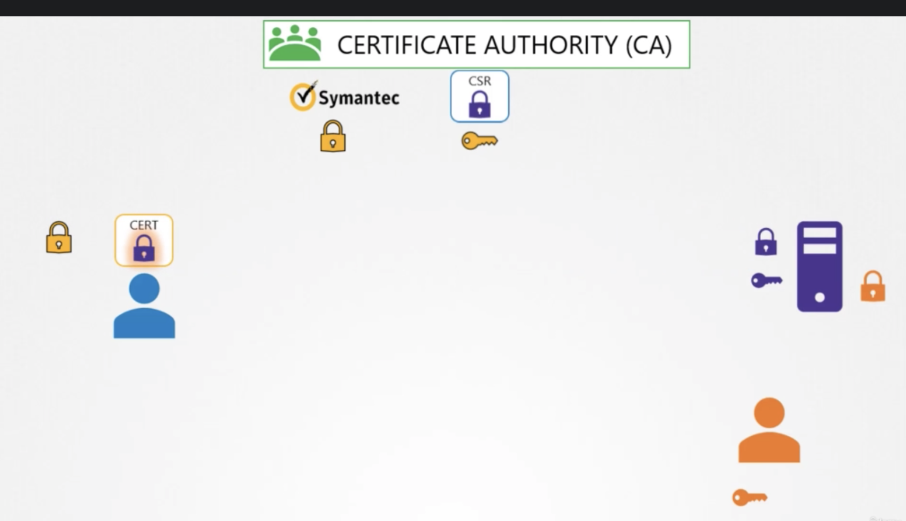
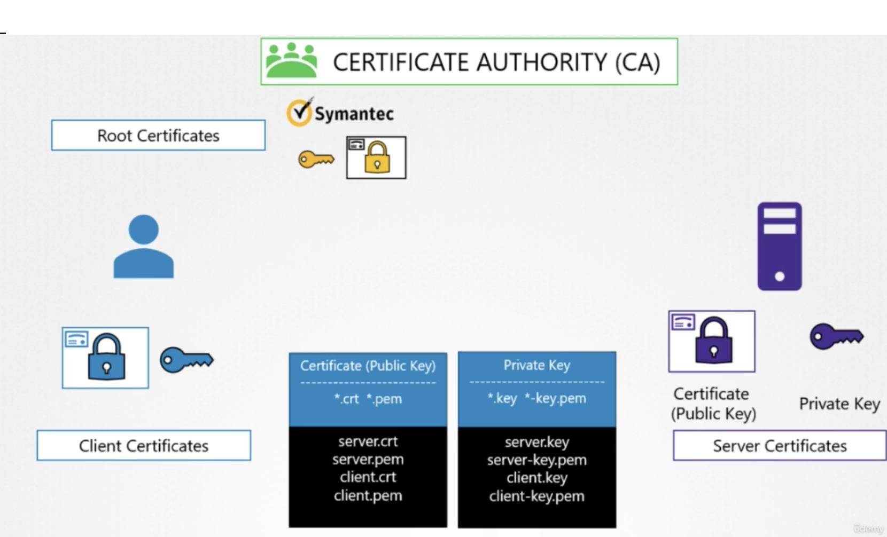
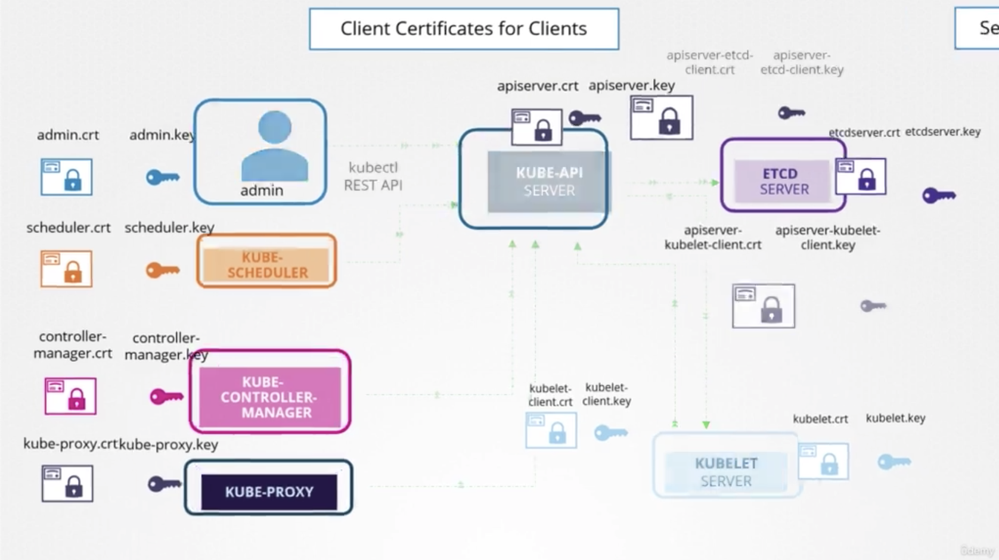
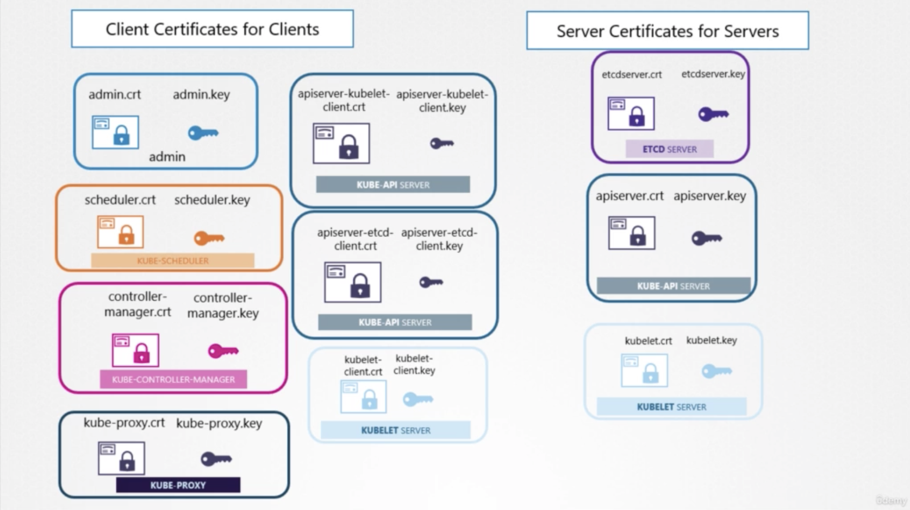

## 📌Security

### TLS

비대칭키를 사용하여 ssl 통신을 하게 되는데, 원리는 이렇다.

client와 server가 있을 때

client는 private key를 가지고 있다.

server 또한 자신의 private key와 public key를 가지고 있다.

server는 먼저 자신의 public key를 보내고(여기서 certificate를 같이 보냄), client는 자신의 private key+server의 public key로 암호화해서 보내며,

server는 자신이 가진 private key로 그걸 푼다. 그러면 client의 private key를 가지겠찌?!

그때부터 client는 자신의 데이터를 private key로 암호화해서 보내고, server는 받은 private key로 암호를 풀어서 읽는당!

**public key 명명규칙 (일반적으로)**

- \*.crt
- \*.pem

**private key 명명규칙 (일반적으로)**

- \*.key
- \*-key.pem

#### TLS in k8s

Cert 컨셉

전체적인 k8s 내부 컴포넌트의 client, server 관계

client certificates for clients와 server certificates for servers 분류

### View Certificates
cert 정보 확인하는 command
` openssl x509 -in /etc/kubernetes/pki/apiserver.crt -text -noout`

udemy에서 제공한 kubernetes-cert-checker.xlsx 파일 참고할 것

### Certificates API

1. CertificateSigningRequest Object
2. Review Requests
3. Approve Requests
4. Shard Certs to Users

### KubeConfig

`$HOME/.kube/config`

아래에 server나 client key, client cert 이런 정보가 있기 때문에 우린 굳이 커맨드 칠 때 다 안써도 되는 것이다.

*Clusters + Users => Contexts*

예를 들어 `Admin@Production (User@Cluster)`

컨피그 볼 수 있음 (clusters, contexts, users 정보들)
`kubectl config view`

### RBAC

Role Binding Access Control으로, role을 정해놓고 user에 할당해서, 권한을 주는 것!

### Cluster Roles and Role Bindings

Role인데, Cluser 단위 - namespace에 속하지 않음.

### Image Security

..?  

### Security Contexts

..?

### Network Policy

pod 기준으로 트래픽이 들어오는 걸 ingress, 나가는걸 egress라고 함.

Network Policy는 k8s 리소스 중에 하나임.
